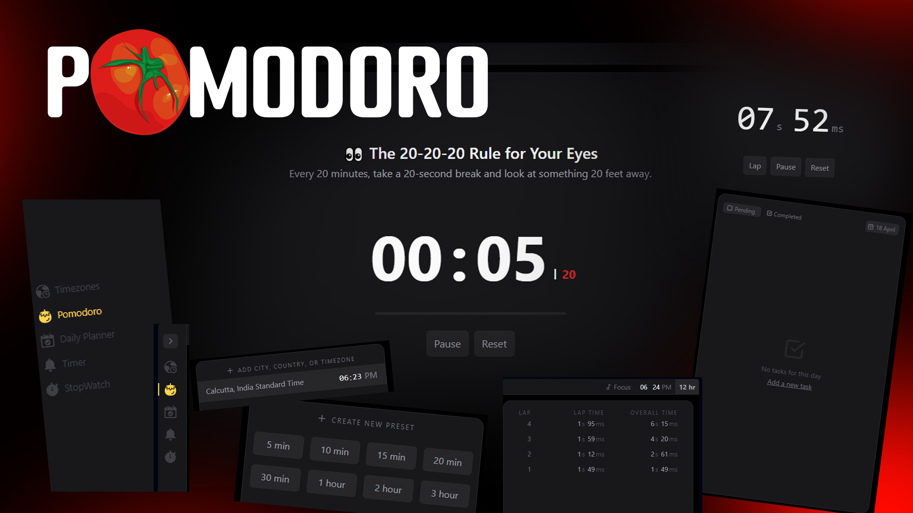
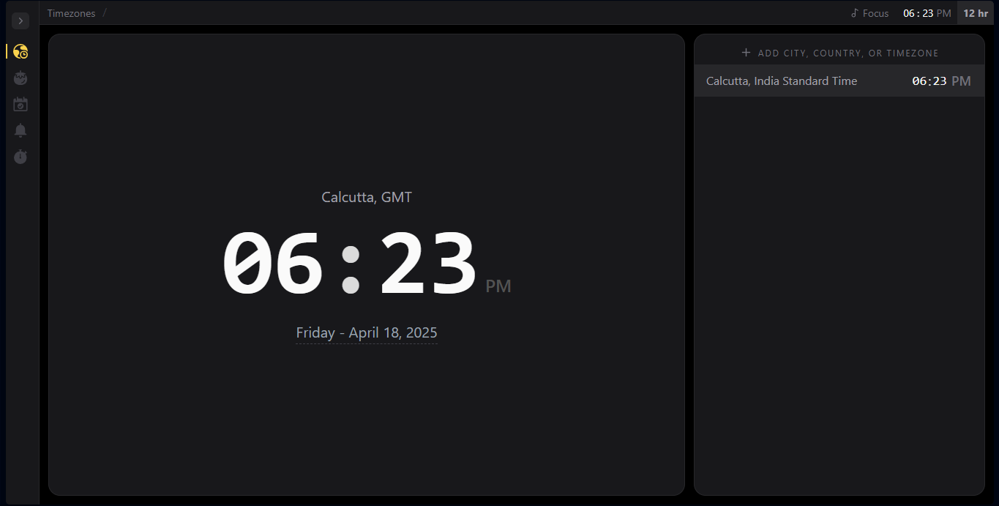
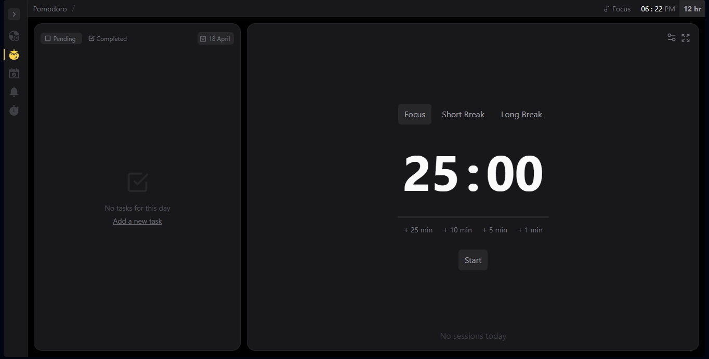
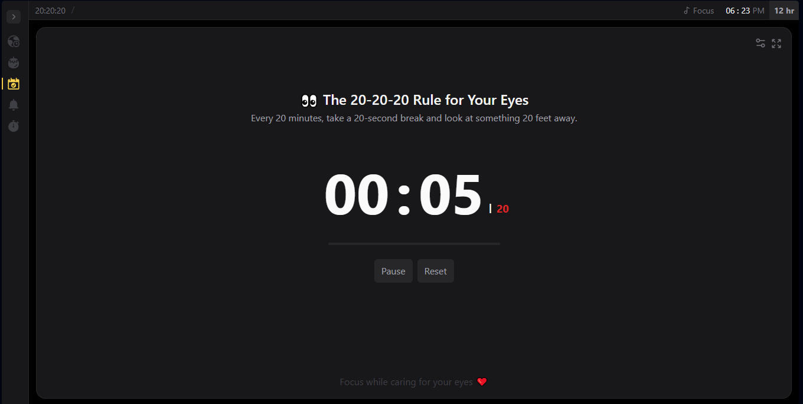
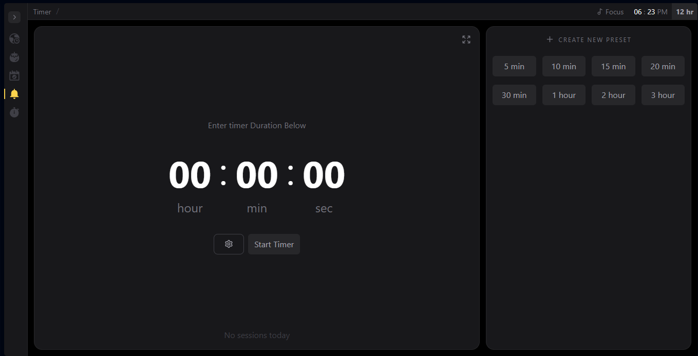
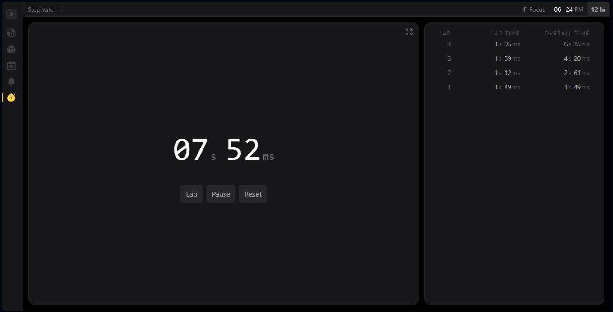

# Productivity Hub ⏳🌍🎯

A modern, sleek, and highly functional productivity web app built with **React**, **Vite**, and **Tailwind CSS**. Designed to help users stay focused, track time, and reduce screen fatigue—all in one place.

> 🚀 **Inspired by [time.fyi](https://time.fyi/pomodoro)**, this productivity app recreates its core features with a modern touch — including **Pomodoro**, **countdown timer**, **stopwatch**, **world clock**, and a custom-built **20-20-20 eye strain reminder** for healthier screen time.

## 🌟 Features

### 1. 🌐 World Time Viewer

- View current time across different timezones.
- Add multiple clocks for various cities to manage global schedules.

### 2. 🍅 Customizable Pomodoro Timer

- Set your own work/break intervals.
- Adjust short/long break durations.
- Dynamically extend ongoing sessions with `+1`, `+15`, or `+30` minute controls.

### 3. 👀 20-20-20 Rule Component

- A wellness-focused timer that reminds you to look 20 feet away every 20 minutes for 20 seconds.
- Plays notification sounds at the start and end of each break.
- Fully customizable intervals and session duration (e.g., 20 → any value).

### 4. ⏲️ Countdown Timer

- Input custom hours, minutes, and seconds.
- Choose from preset durations (e.g., 5 minutes, 1 hour).
- Clean and responsive timer UI.

### 5. ⏱️ Stopwatch with Lap Tracking

- Start/pause/reset stopwatch.
- Record and review lap times.

---

## 🔮 Upcoming Features

### 🎧 Focus Mode
- Background nature sounds (waves, rain, wind, birds) to help with deep work.
- Continuous ambient playback with volume control.

---

> 🚀 **Live Website [Fokus](https://pomodorofokuss.vercel.app/)**

## 🛠️ Tech Stack

- **Framework**: React + Vite
- **Styling**: Tailwind CSS
- **Build Tool**: Vite for lightning-fast dev experience
- **Design**: Clean, modern, and minimalistic UI

---

## 🚀 Getting Started

```bash
# Clone the repository
git clone https://github.com/Neeraj-gupta2005/Pomodoro-Timer.git

# Navigate into the directory
cd productivity-hub

# Install dependencies
npm install

# Run the development server
npm run dev
